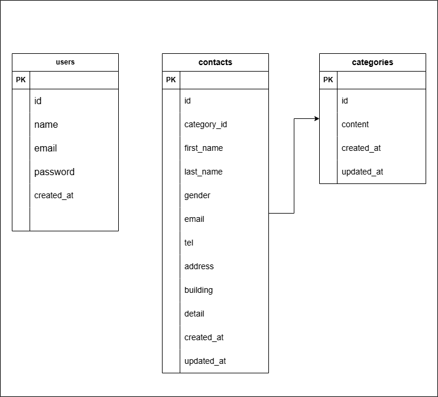

# FashionablyLate

## 環境構築

Dockerビルド

1. git clone git@github.com:aya-mino/contact-form-test.git
2. docker compose up -d --build

Laravel環境構築

1. docker compose exec php bash
2. composer install
3. cp .env.example .env
4. php artisan key:generate
5. php artisan migrate --seed

## 使用技術
- PHP 8.1.34
- Laravel 10.50.2
- MySQL
- Docker

## ER図

## URL
- 開発環境：http://localhost:8087
- phpMyAdmin：http://localhost:8088